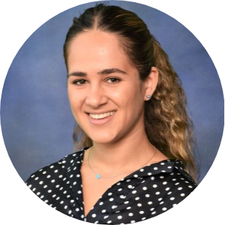

# Opal Issan

{: align=right }

I am currently in my last year as an undergraduate student at [San Diego State University](https://www.sdsu.edu/) (SDSU), majoring in Applied Mathematics 
with an emphasis in Computational Science. I am working under the guidance of Professor Christopher Curtis on finding a finite dimensional approximation of the Koopman operator using deep learning techniques. 
Furthermore, I am a solar physics intern at [Predictive Science Inc.](https://www.predsci.com/portal/home.php), working with Dr. Pete Riley on mapping solar wind streams from the Sun to 1 AU. 

In my graduate studies, I hope to gain critical insight on integrating machine learning techniques to extract principal information from data. These learning techniques play an important role in advancing our understanding of complex physics phenomena. 
My academic background and research experience led me to discover my curiosity in mathematical modeling, numerical optimization, dynamical systems, and machine learning.

## Recent Projects
- [DMD Autoencoder](https://opaliss.github.io/dmd_autoencoder/)
- [HUX](https://github.com/predsci/HUX)
- [Mesh Generator](https://pypi.org/project/mesh-generator/)

## Contact 
Email: opal.issan@gmail.com

