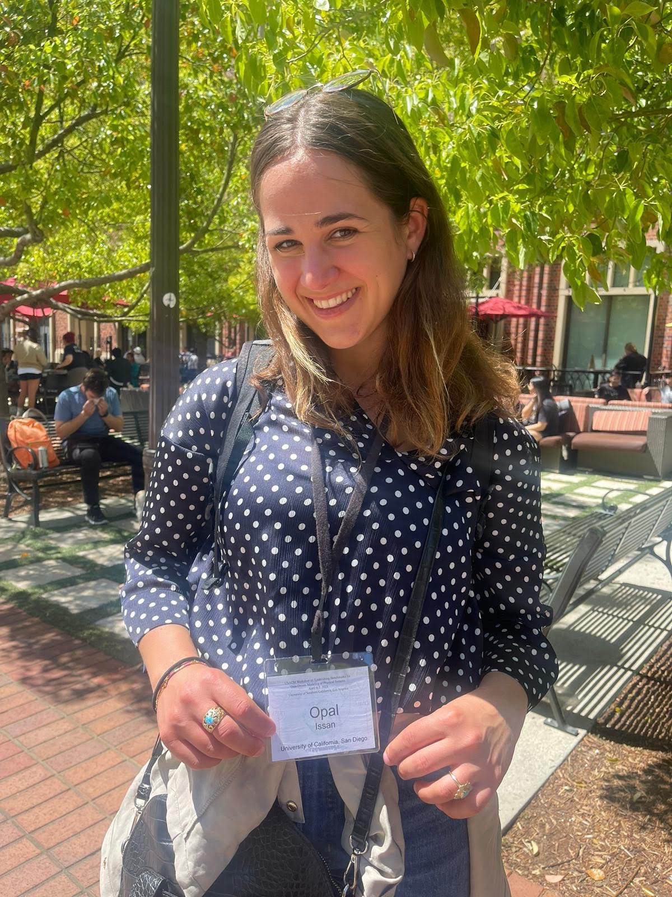

# Opal Issan

{ width=30% : align=right }

I am currently in my last year as an undergraduate student at [San Diego State University](https://www.sdsu.edu/) (San Diego, California), majoring in Applied Mathematics. I am working under the guidance of Professor [Christopher Curtis](https://cwcurtis.github.io/) on finding a finite dimensional approximation of the Koopman operator using deep learning techniques. 
Furthermore, I am a Solar Physics Intern at [Predictive Science Inc.](https://www.predsci.com/portal/home.php), working with Dr. Pete Riley (Vice President, Chief Financial Officer, and Senior Research Scientist) on mapping solar wind streams from the Sun to Earth. 

My research interests are in mathematical modeling, numerical optimization, dynamical systems, and machine learning.

## Publications 
[1] [Riley P and Issan O (2021) Using a Heliospheric Upwinding eXtrapolation Technique to Magnetically Connect Different Regions of the Heliosphere. Front. Phys. 9:679497. doi: 10.3389/fphy.2021.679497](https://www.frontiersin.org/articles/10.3389/fphy.2021.679497/full?&utm_source=Email_to_authors_&utm_medium=Email&utm_content=T1_11.5e1_author&utm_campaign=Email_publication&field=&journalName=Frontiers_in_Physics&id=679497)

## Recent Projects
- [Coronal Hole Probability Maps](http://www.predsci.com/CHD/)
- [Dynamic Mode Decomposition (DMD) Autoencoder](https://github.com/opaliss/dmd_autoencoder/)
- [Heliospheric Upwind eXtrapolation (HUX)](https://github.com/predsci/HUX)
- [Mesh Generator](https://pypi.org/project/mesh-generator/)

## Contact 
Email: opal.issan@gmail.com

